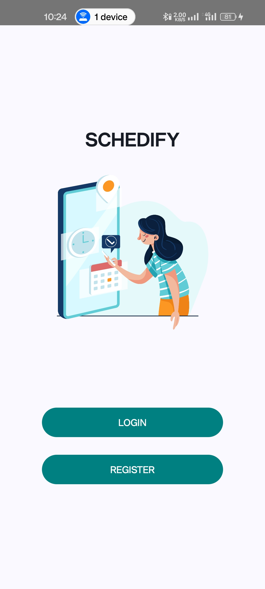
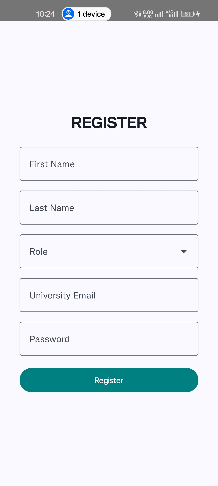
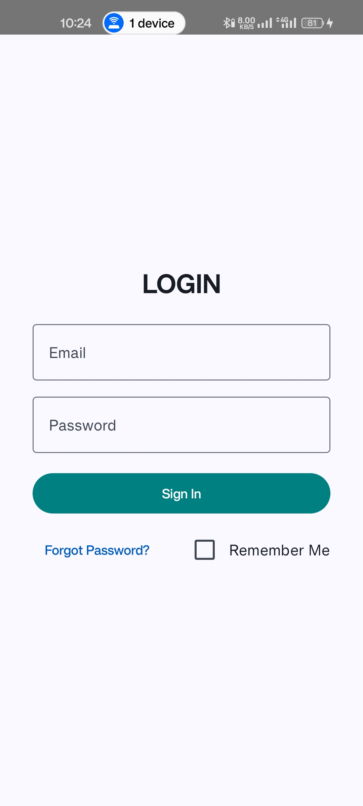
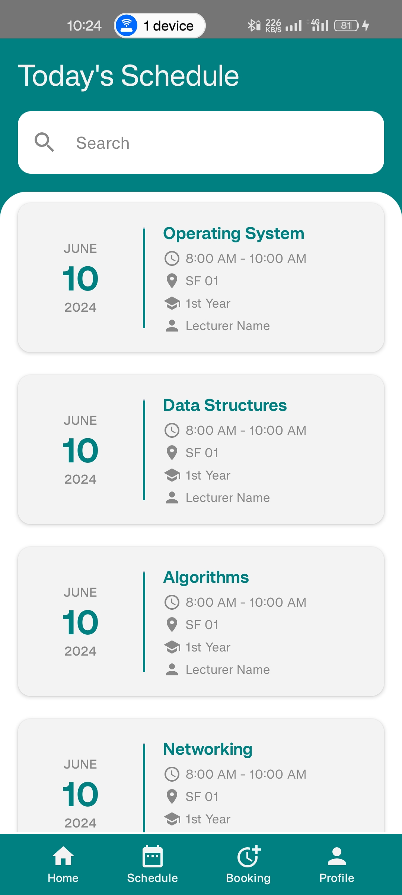
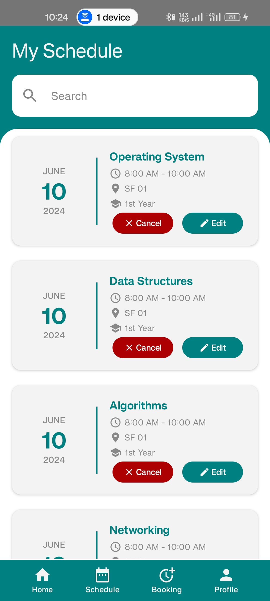
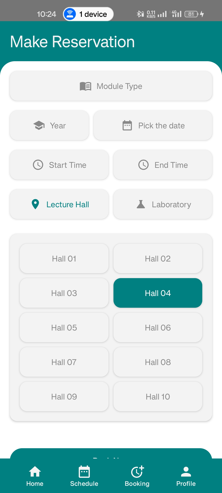

# Schedify 

Schedify is a modern Android application designed to streamline the process of reserving laboratories and lecture halls in educational institutions. Built with Kotlin and adhering to best practices, Schedify offers an intuitive interface and robust scheduling functionalities.

---

## Features
- **Easy Reservation:** Book labs and lecture halls effortlessly.
- **Schedule Card View:** Visualize and manage your reservations.
- **User Authentication:** Secure login system for administrators and users.
- **Notifications:** Stay updated with booking confirmations and reminders.
- **Conflict Detection:** Prevent double bookings with automated checks.

---

## Tech Stack
- **Programming Language:** Kotlin
- **Development Framework:** Android SDK
- **Database:** Firebase Realtime Database
- **Version Control:** Git

---

## Installation

1. Clone this repository:
   ```bash
   git clone https://github.com/gunathilakax/Schedify.git
   ```
2. Open the project in **Android Studio**.
3. Sync project with Gradle files.
4. Build and run the application on an Android emulator or physical device.

---

## Usage
1. Launch the application.
2. Log in or register to access booking features.
3. Navigate to the calendar view and select a date to create a new reservation.
4. Receive confirmation and manage bookings from the dashboard.

---

## Screenshots

| Home Screen | Register Page | Login View |
|-------------|--------------|---------------|
|  |  |  |
| Dashboard Screen | Reservation Page | Booking View |
|-------------|--------------|---------------|
|  |  |  |
---

## Contributing
We welcome contributions to improve Schedify! Follow these steps:

1. Fork the repository.
2. Create a new branch:
   ```bash
   git checkout -b feature/your-feature-name
   ```
3. Commit your changes:
   ```bash
   git commit -m "Add your message here"
   ```
4. Push to the branch:
   ```bash
   git push origin feature/your-feature-name
   ```
5. Submit a pull request.

---

## License
This project is licensed under the [MIT License](LICENSE).

---

## Contact
- **Maintainer:** GunathilakaX  
- **Email:** s.sheharagunathilaka@gmail.com
- **GitHub:** [gunathilakax](https://github.com/gunathilakax)

---

Thank you for using and contributing to Schedify! We hope it simplifies your scheduling process.
